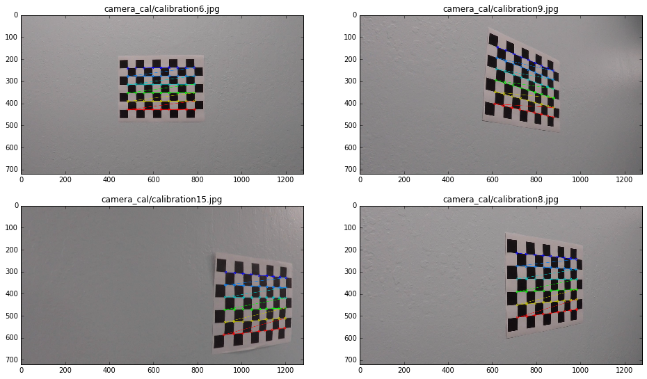
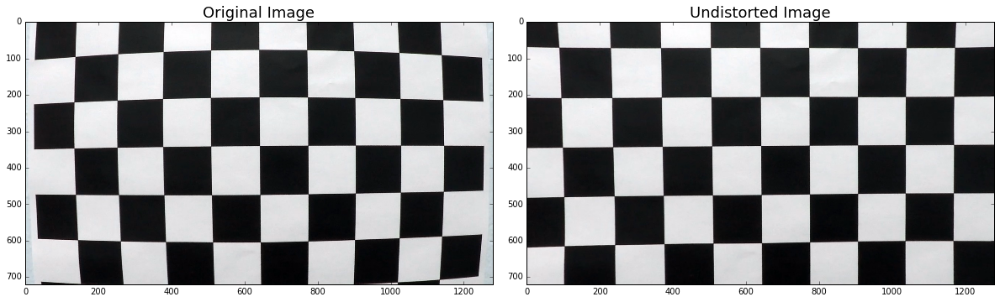
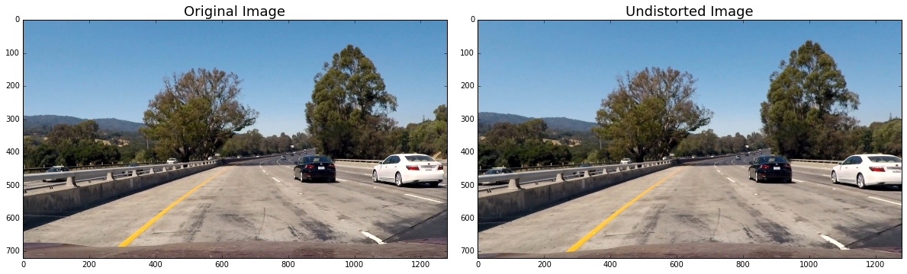
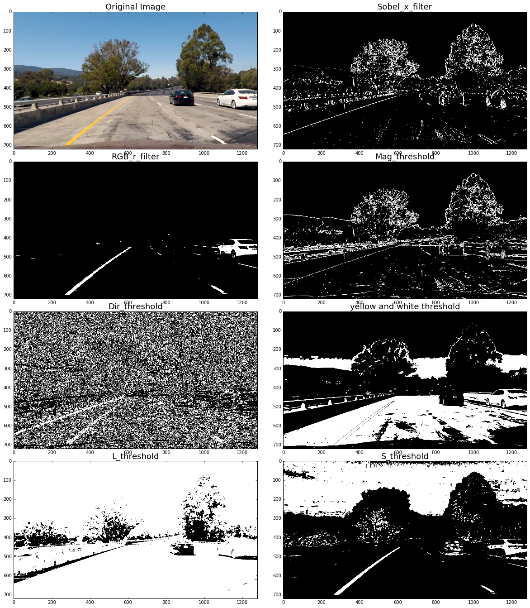
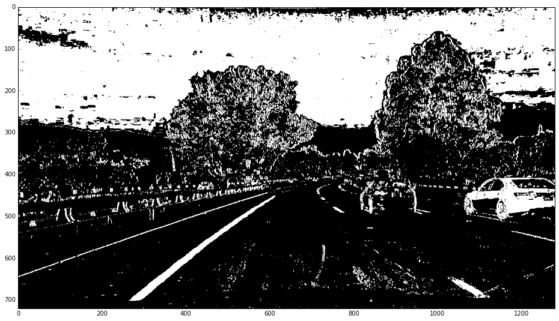
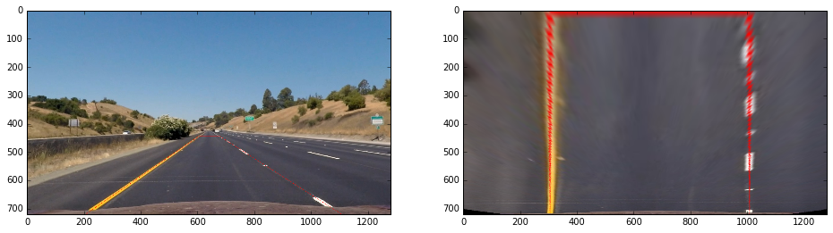
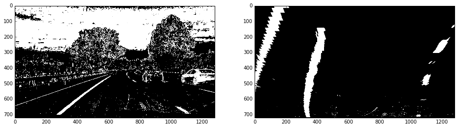
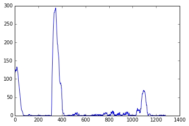
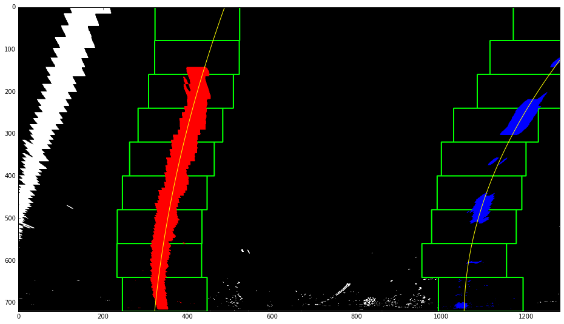
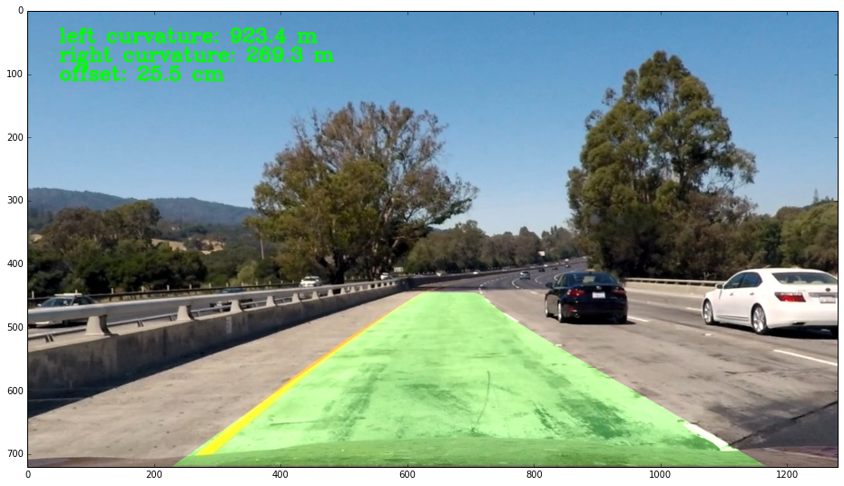

## Writeup of advance lane detection by Chunlei Zhang

---

### The project structure:
* 0_step_by_step.ipynb: A step by step processing
* 1_detect_test_images.ipynb: Detect the line in test images (that means, don't take the privious frame into acount)
* 2_lane_detect_for_video.ipynb: Detect the line in test video (add some function, such as Sanity Check, Smoothing ...)
* process_image.py \& process_video.py: The python files

**Advanced Lane Finding Project**

The goals / steps of this project are the following:

* Compute the camera calibration matrix and distortion coefficients given a set of chessboard images.
* Apply a distortion correction to raw images.
* Use color transforms, gradients, etc., to create a thresholded binary image.
* Apply a perspective transform to rectify binary image ("birds-eye view").
* Detect lane pixels and fit to find the lane boundary.
* Determine the curvature of the lane and vehicle position with respect to center.
* Warp the detected lane boundaries back onto the original image.
* Output visual display of the lane boundaries and numerical estimation of lane curvature and vehicle position.

## [Rubric](https://review.udacity.com/#!/rubrics/571/view) Points

### Here I will consider the rubric points individually and describe how I addressed each point in my implementation.

---

### Writeup / README

#### 1. Provide a Writeup / README that includes all the rubric points and how you addressed each one.  You can submit your writeup as markdown or pdf.  [Here](writeup_template.md) is a template writeup for this project you can use as a guide and a starting point.

You're reading it!

### Camera Calibration

#### 1. Briefly state how you computed the camera matrix and distortion coefficients. Provide an example of a distortion corrected calibration image.
I start by preparing "object points", which will be the (x, y, z) coordinates of the chessboard corners in the world. Here I am assuming the chessboard is fixed on the (x, y) plane at z=0, such that the object points are the same for each calibration image.  Thus, `objp` is just a replicated array of coordinates, and `objpoints` will be appended with a copy of it every time I successfully detect all chessboard corners in a test image.  `imgpoints` will be appended with the (x, y) pixel position of each of the corners in the image plane with each successful chessboard detection. The corners in the chessboard is like:



I then used the output `objpoints` and `imgpoints` to compute the camera calibration and distortion coefficients using the `cv2.calibrateCamera()` function.  I applied this distortion correction to the test image using the `cv2.undistort()` function and obtained this result:


### Pipeline (single images)

#### 1. read the image and undistroted it

To demonstrate this step, I will describe how I apply the distortion correction to one of the test images like this one:


#### 2. Describe how (and identify where in your code) you used color transforms, gradients or other methods to create a thresholded binary image.  Provide an example of a binary image result.

***define the color and gradient filter functions***
I define some some color and gradient filters to see which is better for this problem. To show the results, I plot them:


Finally, I used a combination of `sobel_x_filter` and `L_threshold` , `S_threshold` to generate a binary image. Here's an example of my output for this step



#### 3. Describe how (and identify where in your code) you performed a perspective transform and provide an example of a transformed image.

The code for my perspective transform includes a function called `perspective_transform()`. In video processing, a class called `ImageInfo` is defined to store the warp information (I think the PerspectiveTransform imformation is static, there is no need to compute the M and M_inverse every frame). The detail of the class is:

```python
class ImageInfo(object):
    def __init__(self, raw_image):
        self.img_size = raw_image.shape
        self.wrap_offset = 100
        src_corners = [(603, 445), (677, 445), (1105, self.img_size[0]), (205, self.img_size[0])]
        dst_corners = [(205 + self.wrap_offset, 0), (1105 - self.wrap_offset, 0), (1105 - self.wrap_offset, self.img_size[0]),
                       (205 + self.wrap_offset, self.img_size[0])]
        self.M = cv2.getPerspectiveTransform(np.float32(src_corners), np.float32(dst_corners))
        self.M_inverse = cv2.getPerspectiveTransform(np.float32(dst_corners), np.float32(src_corners))
```

This resulted in the following source and destination points:

| Source        | Destination   |
|:-------------:|:-------------:|
| 603, 445      | 305, 0        |
| 677, 445      | 1005, 0      |
| 1105, 720     | 1005, 720      |
| 205, 720      | 305, 720        |

The warp result of a straight line and test line are:





#### 4. Describe how (and identify where in your code) you identified lane-line pixels and fit their positions with a polynomial?

 Get the histogram of pixel == 1：
 

Get the pixel which is believed to be the lane pixels by using sliding window. The detail is in function `find_line_fit（）`：
 

#### 5. Describe how (and identify where in your code) you calculated the radius of curvature of the lane and the position of the vehicle with respect to center.

The radius of curvature is calculate in function `getCurveRadius()` and the car offset from the center of the lane is calcluate in function `getCarPositionOffCenter()`


#### 6. Provide an example image of your result plotted back down onto the road such that the lane area is identified clearly.

First I project back the fitted line to the original sight. Then the radius of curvature and offset of the car has been drawed in the image.



---

### Pipeline (video)

#### 1. Provide a link to your final video output.  Your pipeline should perform reasonably well on the entire project video (wobbly lines are ok but no catastrophic failures that would cause the car to drive off the road!).

For the video processing, I defined a class called `Line` to represented a line in this problem. It buffered last n successful frame. Beside, the sliding window search is a little bit different from the code in image process. I use two function: `find_line_pixel_from_detected()` and `find_line_pixel_without_detected()` to find the line pixels.

Then I use a 2 order polynomial to fit the line pixels of left and right line. A `sanity_check()` function is performed to determin is it a "bad" frame. if is bad, pop the buffered queue and use the avg of buffered coefficients as the best fit coefficients. if this frame is good, accept it and add it to the queue. The best fit x is the avg x of the buffered frame which is to do smooth.
Here's a [link to my video result](test_videos_output/project_video.mp4)

---

### Discussion

#### 1. Briefly discuss any problems / issues you faced in your implementation of this project.  Where will your pipeline likely fail?  What could you do to make it more robust?
The pipeline will fail as soon as more (spurious) lines are on the same lane, as e.g. in the first challenge video. This could be solved by building separate lane line detectors for yellow and white together with additional logic which line to choose.
